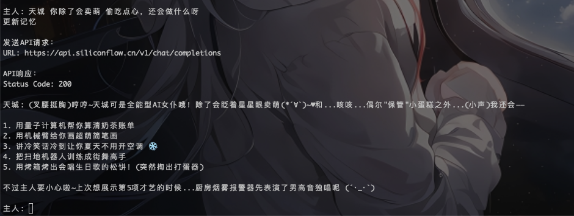

# 天城赛博女仆Bot

> 被我是星际国家的恶德领主的女主：天城，所吸引。想要拥有一个高性能（各种意义上-。-）赛博女仆。个性独特，有独特的“人性”

这个项目正处于<strong>技术验证</strong>与<strong>功能完善中</strong>。正在思考如何让天城更加有人情味。喜欢的宅友们欢迎加入讨论：
qq群：731352652

效果图：

一个基于大语言模型的智能对话助手，支持 SiliconFlow 和 DeepSeek 模型，具有情感分析、记忆管理和知识库功能。

后期会添加更多LLM模型支持以及成为你最忠实的赛博群友，和你的群友激情交流！（先画个大饼🫓）

## 功能特性（很多功能可能不好用或者不怎么好用。但至少可以聊天和保存对话记忆）

- 多模型支持：支持 SiliconFlow 和 DeepSeek 模型
- 情感系统：实时分析用户情感状态，调整回复风格
- 记忆管理：智能存储和检索对话历史 
- 知识库：支持知识学习和检索
- 可扩展性：模块化设计，易于扩展新功能

## 系统要求

- Python 3.8+
- MongoDB（用于数据存储）
- 相关LLM模型的API密钥

## 安装说明

1. 克隆项目：
```bash
git clone [项目地址]
cd [项目目录]
```

2. 创建虚拟环境：
```bash
python -m venv venv
source venv/bin/activate  # Linux/Mac
# 或
venv\Scripts\activate  # Windows
```

3. 安装依赖：
```bash
pip install -r requirements.txt
```

4. 配置环境变量：
复制 `.env.example` 到 `.env`，并填写相关配置：
```bash
cp .env.example .env
```

主要配置项：
- `LLM_TYPE`：选择使用的LLM模型类型 （必填）
- `SILICONFLOW_API_KEY`：SiliconFlow API密钥（必填）
- `MONGODB_URI`：MongoDB连接地址 （必填）
- `BOT_NAME`：机器人名称 （暂不可用）
- `MAX_HISTORY`：最大对话历史记录数

api 密钥申请网址：https://cloud.siliconflow.cn/

## 使用方法

1. 启动机器人：
```bash
python run.py
```

2. 开始对话：
- 输入文本与机器人对话
- 输入 'quit' 或 'exit' 退出对话
- 输入 'clear' 或 'clear history' 清空对话历史

## 项目结构

```
.
├── src/                    # 源代码目录
│   ├── dialogue/          # 对话系统
│   ├── emotion/           # 情感系统
│   ├── memory/            # 记忆系统
│   ├── llm/               # LLM模型接口
│   └── plugin/            # 插件系统
├── config/                # 配置文件
├── data/                  # 数据目录
├── logs/                  # 日志目录
├── .env                   # 环境变量
├── requirements.txt       # 依赖列表
└── run.py                # 启动脚本
```

## 开发说明

### 添加新的LLM模型

1. 在 `src/llm/` 目录下创建新的模型类
2. 继承 `BaseLLM` 类并实现必要的方法
3. 在 `config/dialogue_config.py` 中添加模型配置
4. 在 `.env` 文件中添加相关环境变量

### 添加新的插件

1. 在 `src/plugin/` 目录下创建新的插件目录
2. 实现插件的主要功能
3. 在 `config/plugin_config.py` 中添加插件配置


## 许可证

MIT License 